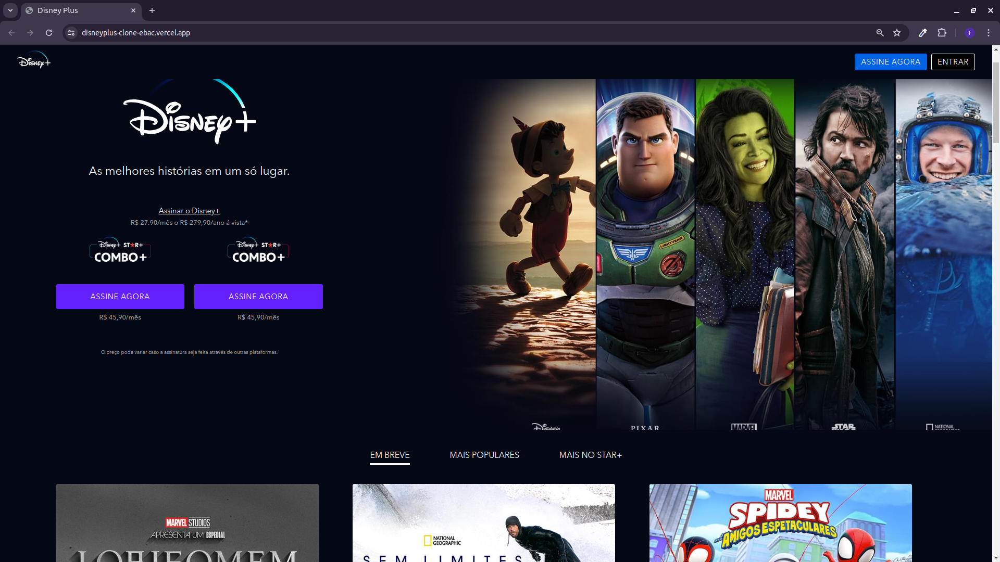

# DisneyPlus Project Installation and Initialization Guide

This guide describes the steps needed to install and initialize the DisneyPlus project, which uses HTML, SASS, JavaScript, and Gulp.

## Prerequisites
- Node.js (version 12 or higher)
- npm (usually included with Node.js)
- Git (optional, for cloning the repository)

## Installation Steps

1. **Clone the repository** (if applicable):
    ```bash
    git clone <https://github.com/fernandohiroshi/disneyplus_clone_ebac.git>
    cd disneyplus
    ```

2. **Install project dependencies**:
    Ensure you are in the project directory and run:
    ```bash
    npm install
    ```

## Available Scripts

- `npm run dev`: Starts Gulp in development mode, watching for file changes.

- `npm run build`: Runs Gulp to build the files for production.

## Project Structure

The project is configured with the following scripts in the `package.json` file:

```json
"scripts": {
  "dev": "gulp watch",
  "build": "gulp",
  "test": "echo \"Error: no test specified\" && exit 1"
}
```



[Visit the Live Site](https://disneyplus-clone-ebac.vercel.app/)

[](https://skillicons.dev)